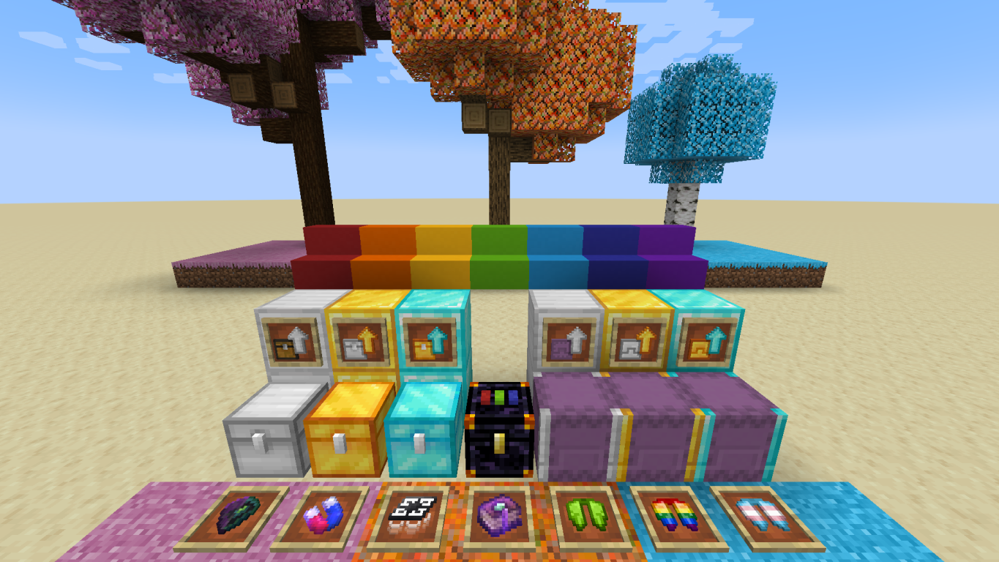

# sc-goodies

<!-- modrinth_exclude.start -->

<!-- modrinth_exclude.end -->

Fabric 1.20 mod for the SwitchCraft server. "Lemmmy's bag of tricks" - a collection of tiny additions designed for the
SwitchCraft server in the style of many older mods. Highly opinionated.

## Features

- Basic iron chests, in the style of cpw's [ironchest](https://github.com/progwml6/ironchest).
  - This is a significantly more primitive take on the iron chests concept with "no BS" - it simply adds iron, gold,
    and diamond versions of chests, barrels and shulker boxes.
  - Also adds a Barrel Hammer that allows you to convert Chests to Barrels and vice versa.
- [EnderStorage](https://github.com/TheCBProject/EnderStorage) style chests.
- Hover Boots, in the style of [OpenComputers](https://github.com/MightyPirates/OpenComputers).
- Item Magnet
- Dragon Scales, in the style of [Quark](https://github.com/VazkiiMods/Quark/).
- Dyeable Elytra, in the style of Quark. Adds Elytra in the 16 dye colors, as well as a few special ones.
- Ancient Tomes, in the style of Quark.
- Popcorn
- Concrete stairs and slabs, speed-up when walking on concrete
- Endermites bury into Purpur Blocks to form Shulkers, similar to Quark.
- Sakura Trees, Maple Trees, Peppy Trees
- Pink Grass, Autumn Grass, Peppy Grass

## Modpacks

Modpack use: **allowed**

This mod (`sc-goodies`) was created primarily for use by the SwitchCraft server, but you are **allowed** to use the
mod in your own modpack. The mod is provided as-is: there is a hodgepodge of features, and it is not planned to make
the feature set configurable for other people's needs; it is created specifically for SwitchCraft.

Please note that each custom SwitchCraft mod has its own license, so check the license of each mod before using it in
your modpack.

## License

This mod and it's source code is licensed under the 
[MIT license](https://github.com/SwitchCraftCC/sc-goodies/blob/HEAD/LICENSE).
